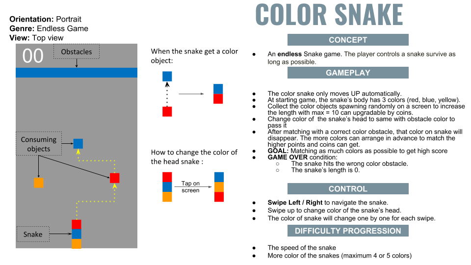
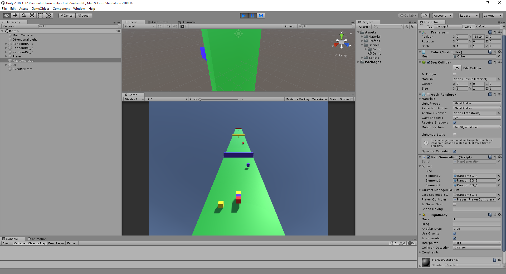

# Color Snake Endless Runner

## Overview

A mini game prototype. The player controls a snake survive as long as possible.

## Features:

* Prefabs everywhere.
* Map generator will be done automatically, basing on `BG List` configurated from `MapGeneration`.
* GD can change more thing like speed, add levels, swipe distance...

### Changing. To do this:
1. Modify **Bg List** in MapGeneration prefab.
2. Folling **RandomBG_x** prefab to create more. Obstacle/ Background, Color objects defined here.

## Upgrading

* Move all configuration to same place that GD can change it easier.
* To add more level prrfab.
* To add tutorial.

## Android Setup

* Unity : 2018.3
* SDK : android-sdk-windows 
* JDK : jdk1.8.0_101

## Run the Project

To build and run on Android, click
**File > Build Settings**, select the **Android** platform, then
**Switch to Platform**, then **Build and Run**.

Or install the apk inside Bin\Android\

## Special Thanks

This section lists people who have contributed to this project by writing code, improving documentation or fixing bugs.

* Nam GD for good concept.